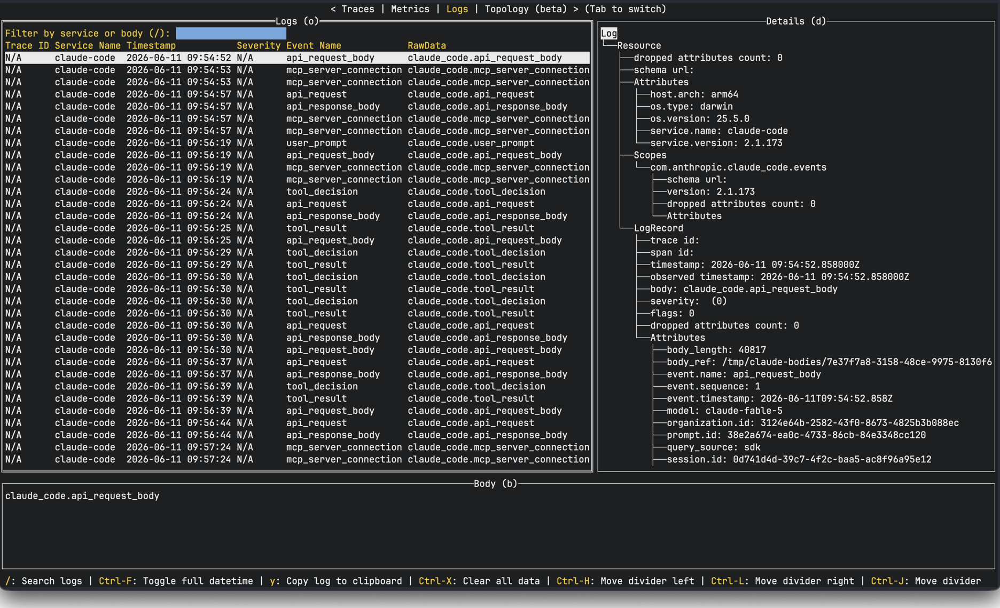

# Claude Code OTel monitoring

View the logs and metrics Claude Code emits via OpenTelemetry — user prompts, API requests/responses, tool decisions and results, MCP connections — live in a terminal UI.



## How it works

Claude Code emits OTel telemetry — including [audit and security events](https://code.claude.com/docs/en/monitoring-usage#audit-security-events) — when `CLAUDE_CODE_ENABLE_TELEMETRY=1`. This repo installs a [managed settings](https://code.claude.com/docs/en/monitoring-usage) file (`/Library/Application Support/ClaudeCode/managed-settings.json`) that turns telemetry on and exports logs and metrics over OTLP to `http://localhost:4318`, where [otel-tui](https://github.com/ymtdzzz/otel-tui) displays them.

Why not just `OTEL_LOGS_EXPORTER=console`? Console output fights the TUI: Claude Code constantly repaints the terminal, so events printed to stdout are unreadable in an interactive session. Exporting over OTLP to otel-tui in a separate terminal is what makes the telemetry actually watchable.

It also enables prompt logging, tool details, and raw API bodies via `OTEL_LOG_RAW_API_BODIES=file:/tmp/claude-bodies`: full request/response payloads are too large to inline in log events, so each event carries a `body_ref` attribute (visible in the Details pane above) pointing to a JSON file under `/tmp/claude-bodies`. Inspect one with e.g. `jq . /tmp/claude-bodies/<id>`. The directory is unencrypted and contains complete prompts and responses — clear it when you're done, and note `/tmp` is wiped on reboot.

## Usage

```sh
make deps       # brew install ymtdzzz/tap/otel-tui
make install    # install managed settings (sudo)
make tui        # run otel-tui in another terminal
claude          # start a session; events appear in the TUI
```

Other targets:

```sh
make show       # print currently installed managed settings
make uninstall  # remove managed settings
```

Restart `claude` after installing or uninstalling.

## References

- [Claude Code monitoring & audit events](https://code.claude.com/docs/en/monitoring-usage#audit-security-events)
- [How we contain Claude](https://www.anthropic.com/engineering/how-we-contain-claude)
- [Claude Code control & observability with OpenTelemetry](https://generalanalysis.com/guides/claude-code-control-observability-opentelemetry) — an interesting POV on *what* to monitor: permission decisions, tool usage patterns, cost per session
